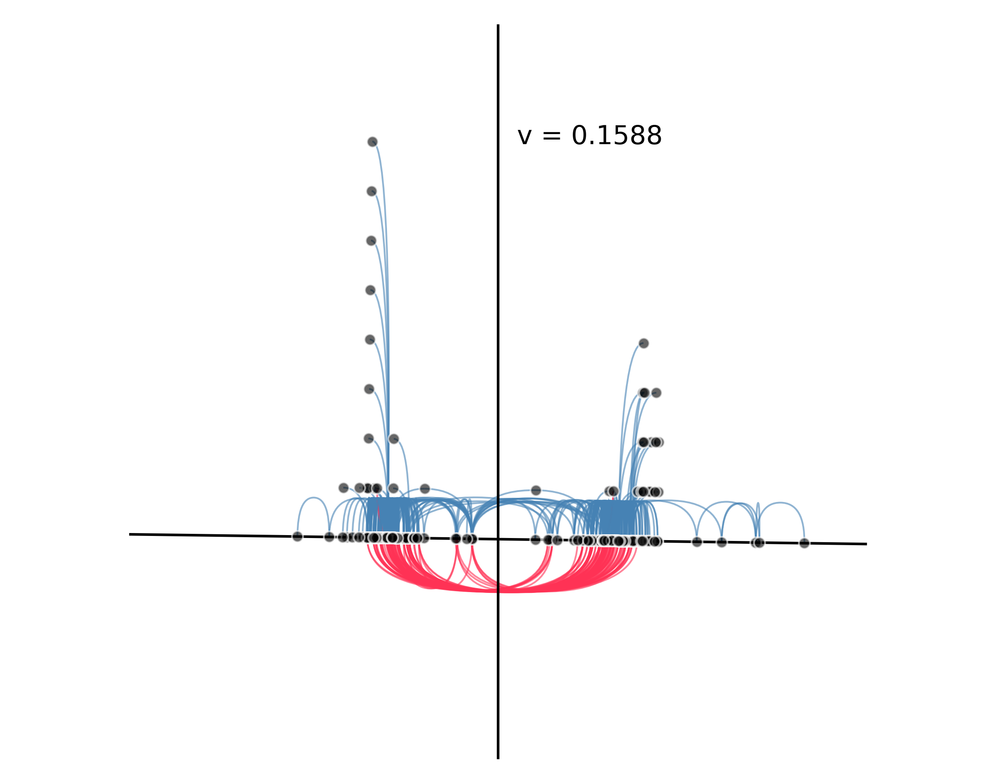

# Structural Balance in networkx Graphs
An algorithm for visualisation of directed and connected signed networkx Graphs.

This repository is a Python realisation of the algorithm in

Galimberti E., Madeddu C., Bonchi F., Ruffo G. (2020) **Visualizing Structural Balance in Signed Networks**. 
In: Cherifi H., Gaito S., Mendes J., Moro E., Rocha L. (eds) Complex Networks and Their Applications VIII. 
COMPLEX NETWORKS 2019. Studies in Computational Intelligence, vol 882. Springer, Cham. 
[https://doi.org/10.1007/978-3-030-36683-4_5](https://doi.org/10.1007/978-3-030-36683-4_5)

This algorithm is based on the spectral properties of the adjacency matrix of a connected, directed and signed graph. It maps each node on a two-dimensional space, 
divided in two groups by the y axis, where the x coordinate is a proxy for the degree of segregation of each node: nodes around x = 0 are in between of the two sides,
because they share positive links with nodes of both the two components; nodes far from x = 0 are extremely polarised, because they share positive links only with 
nodes of their own group.
The y coordinate is picked avoiding overlaps between nodes. Finally, the x axis is rotated proportionally to size of the two groups, thus rendering the distribution 
of nodes in each partition.

A single snapshot of the United States Congress. Each node is a congressman, blue lines are positive edges (i.e. same vote) while red lines are negative edges (i.e. opposite vote). The network is structurally balanced, with little to no frustrated edges and two partitions of roughly the same size.
